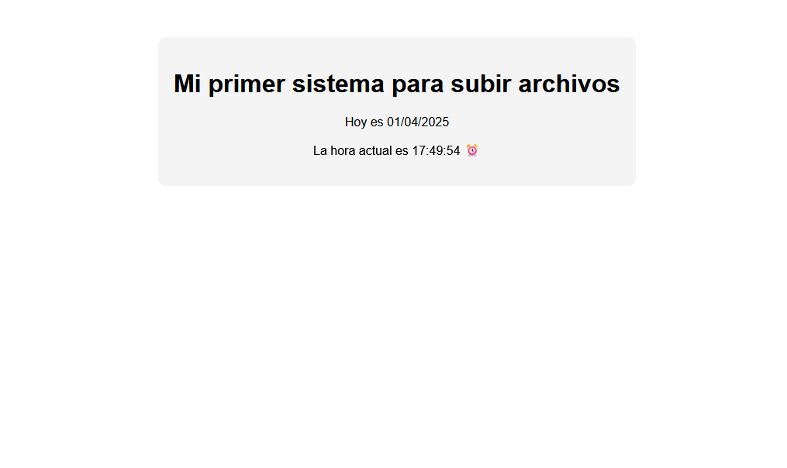

<h1> VMNoobSysAdmin </h1>

<h2> Máquina diseñada para pruebas de seguridad y pentesting en un entorno controlado.</h2>

<h3> 🔴 Disclaimer</h3>

Esta máquina es solo para fines educativos y pruebas en entornos controlados. No me hago responsable del mal uso de este recurso.

 
 

<h3>🚀 Caracteristicas </h3>

✅ Vulnerabilidades incluidas: Misconfiguration(credenciales por defecto, permisos excesivos, Errores de configuración de acceso)

✅ Nivel de dificuldad : Facil

✅ Basada en : Debian 

✅ Pensada para : CTF

🚩 Flags : 2 usuario | root

---

<h3>🔧 Instalación</h3>
<h4>Descarga del siguiente enlace</h4>
🔗 Link:  https://drive.google.com/drive/folders/1vpqY_gyGa7OPG_LSu9DGpGxgFphelLzU?usp=drive_link
🔒 Password: RS{BhZY49Lz0g%?@DU|j-}

---

<h3>🎯 Objetivo </h3>

💡 Para completar este reto, debes conseguir escalar privilegios como root explotando las vulnerabilidades presentes en el sistema.

---

<h3>👣 Pistas</h3>

💡 La enumeración es muy importante!

---

<h3>Información del Archivo</h3>

 SHA256: 9C039F1A761D89495B310E7976AE47F612A04505268A993A1E9EFBADA18DDF73 

 NOmbre del archivo: NoobSysAdmin.ova

---

<h3> Capturas </h3>

